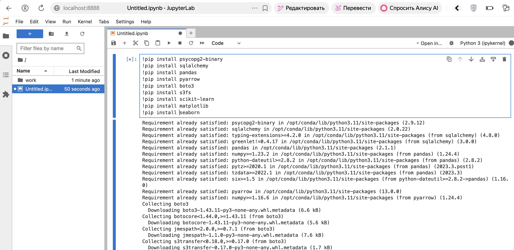
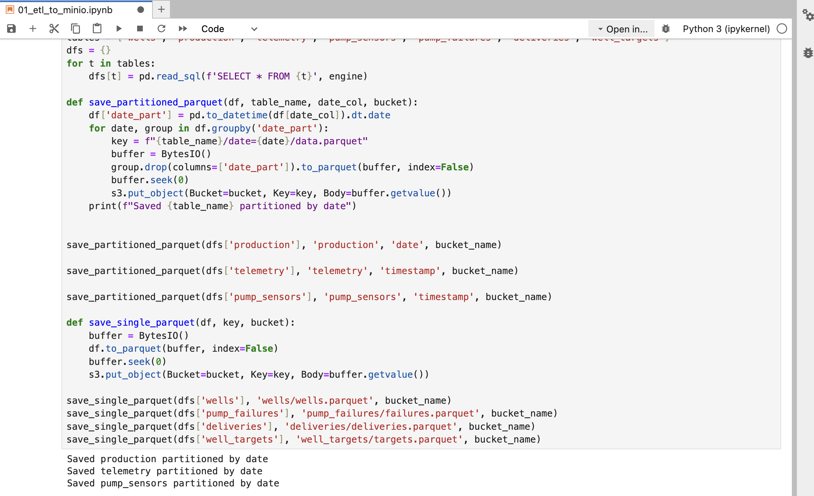
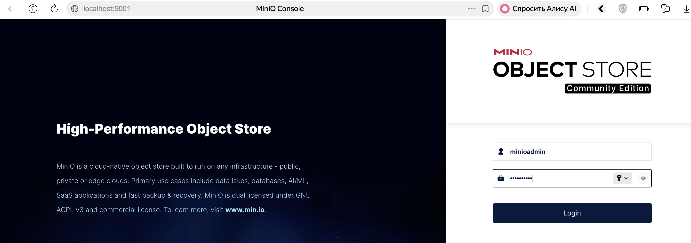
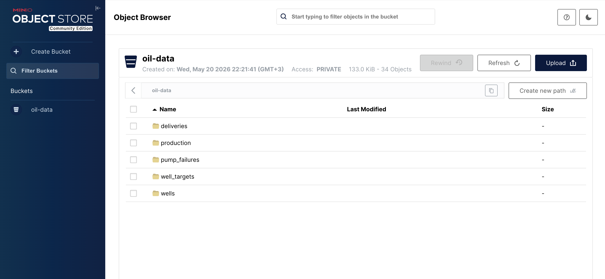
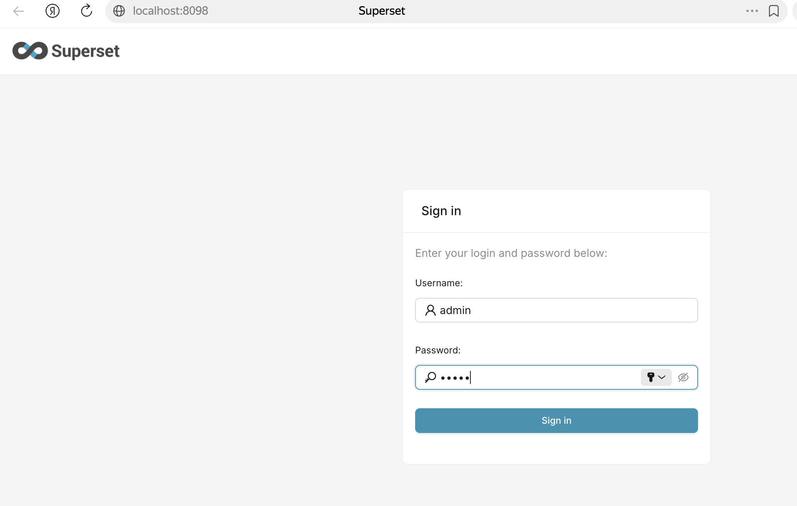
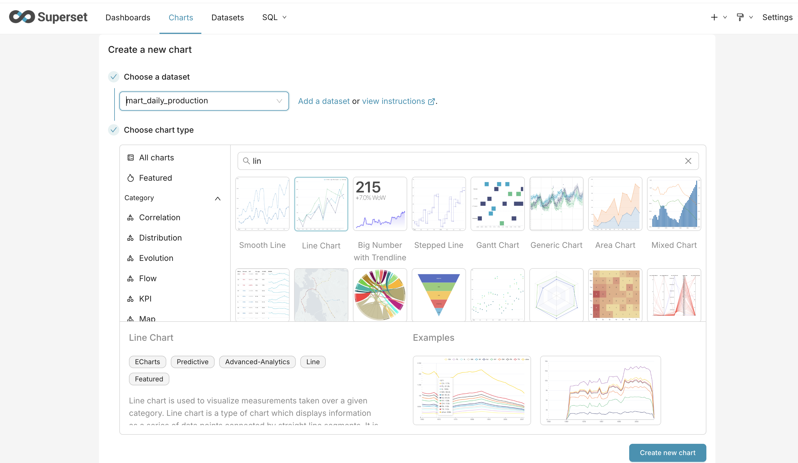
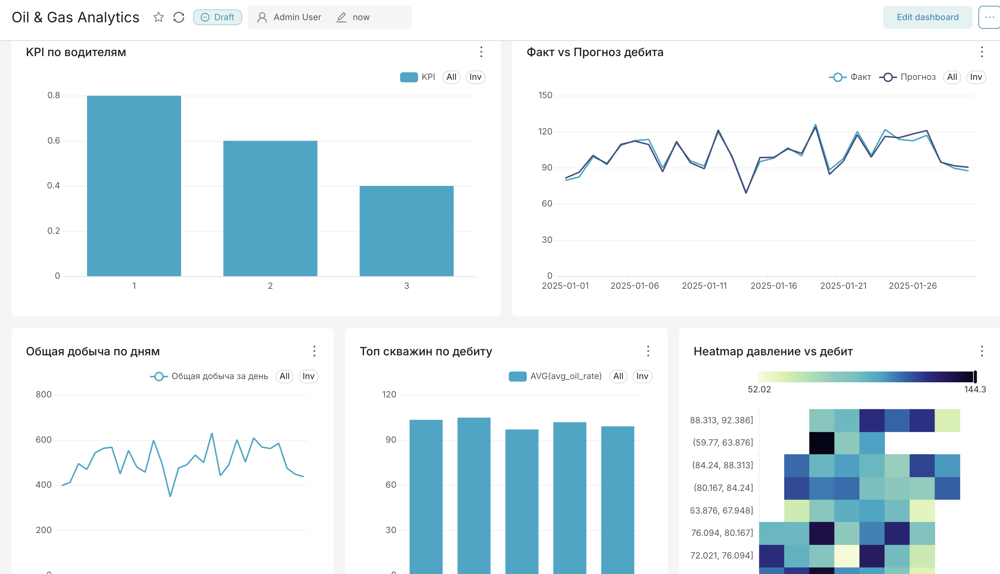

# Домашнее задание - Big Data и ML

Запустим наш docker-compose и зайдем в Jupyter  

  
  
Установим необходмые зависимости   
  

  
Сохраним файлы  
  

  
Зайдем в Minio и посмотрим на созданные файлы  
  

  
  
  

  
  
Зайдем в Superset   
  

  
  
Создадим подключение к БД и создадим необходимые графики   
  

  
  
По итогу получится следующий дашборд   
  
