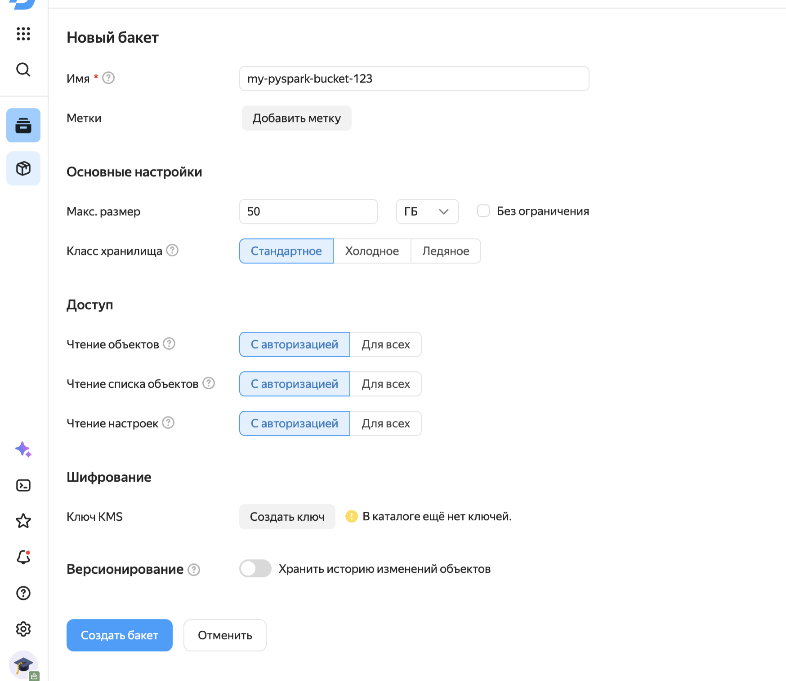
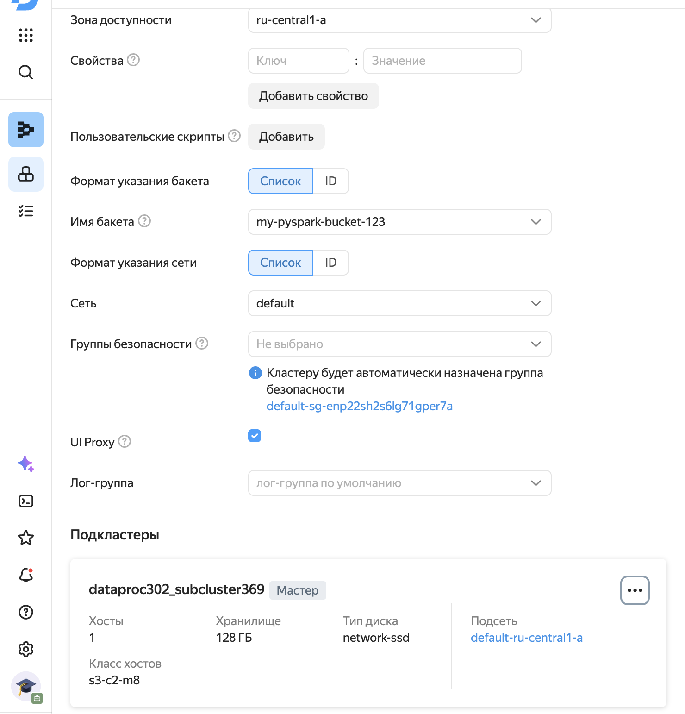
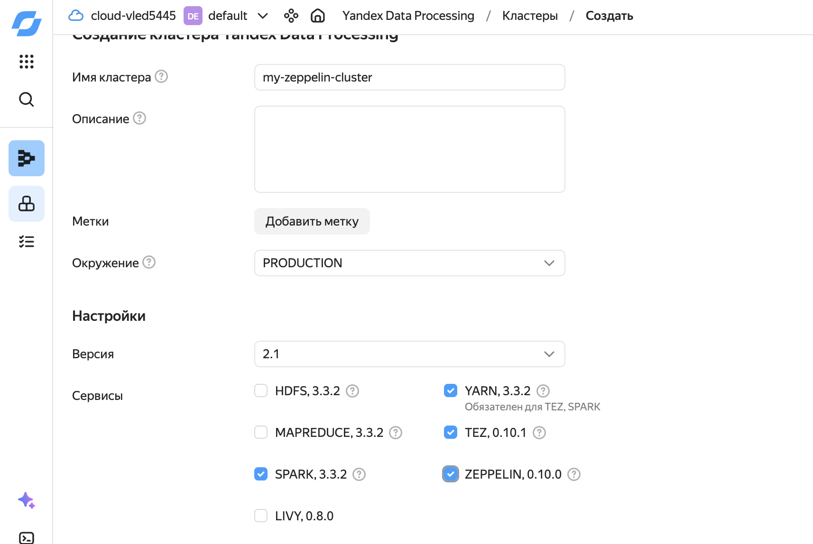
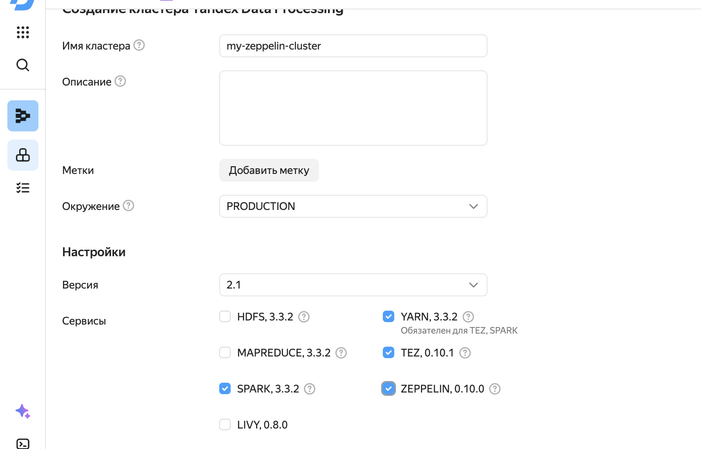
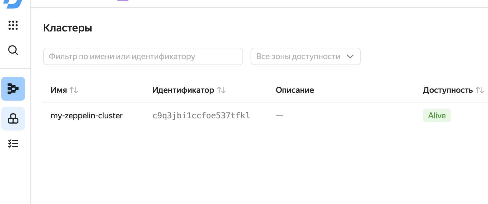
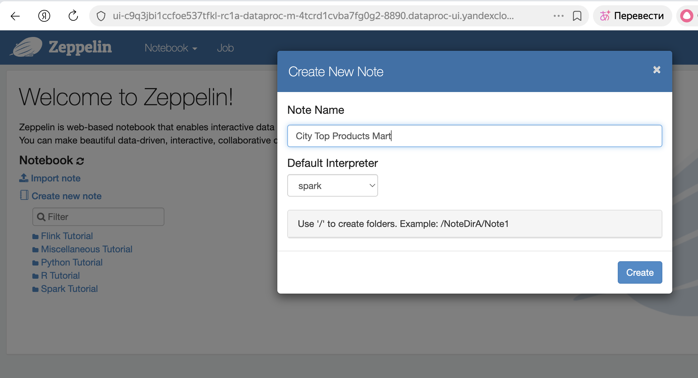
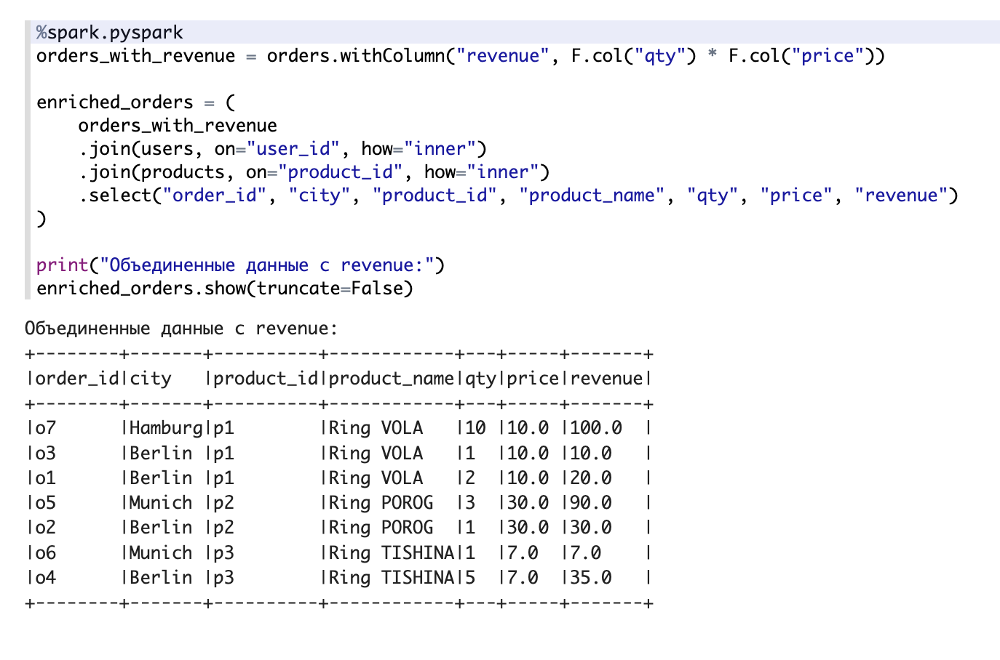
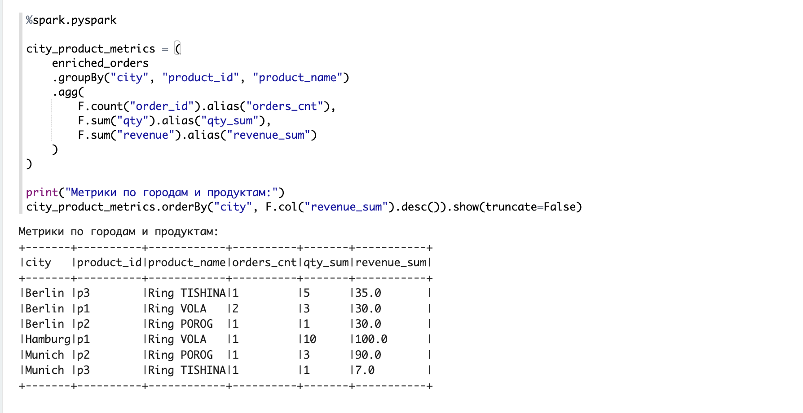
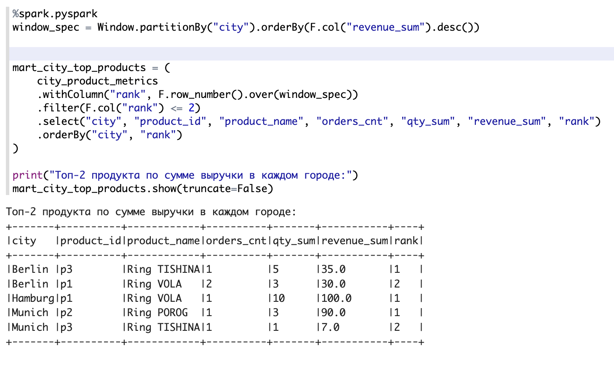

# Домашнее задание: Яндекс Cloud и PySpark

## Что сделано

Собрал витрину `mart_city_top_products` с топ-2 товарами по выручке для каждого города. Использовал PySpark в Zeppelin на Yandex Cloud.

## Данные

Три таблички: пользователи, заказы и товары. Всё создавал прямо в ноутбуке.

## Что происходит в коде

1. Считаю выручку: `revenue = qty * price`
2. Джойню заказы с пользователями и товарами
3. Группирую по городу и товару, считаю количество заказов, сумму qty и выручку
4. Через оконную функцию выбираю топ-2 товара по выручке в каждом городе
5. Сохраняю результат в S3 и локально в parquet
6. Читаю обратно и показываю

Скриншоты с настройкой Yandex Cloud и запуском кода PySpark

